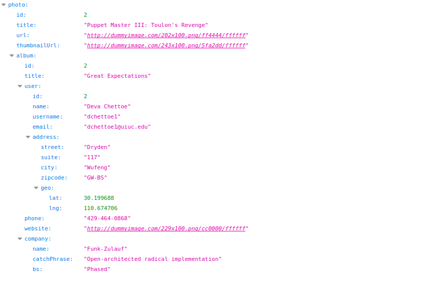
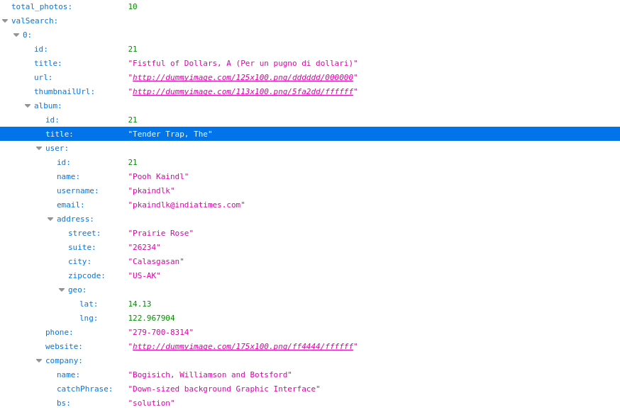
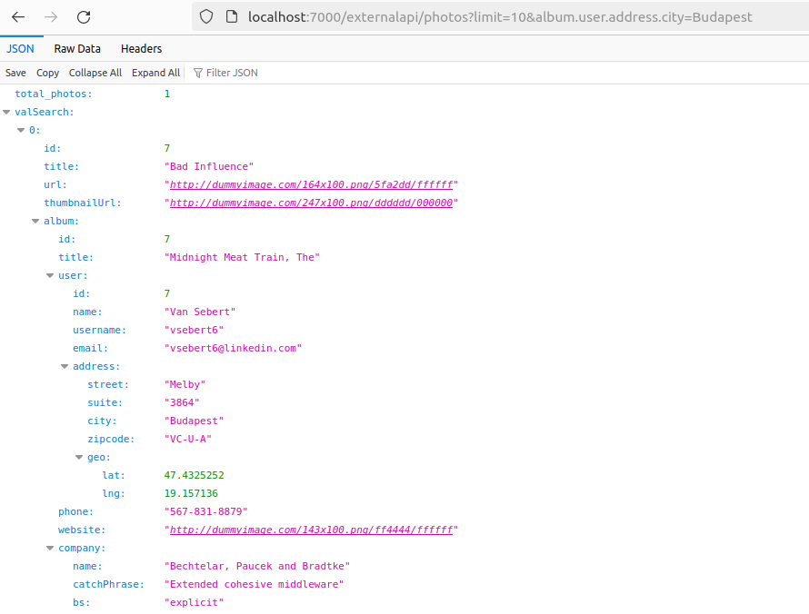
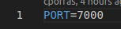
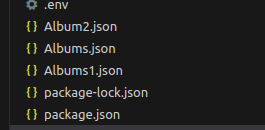
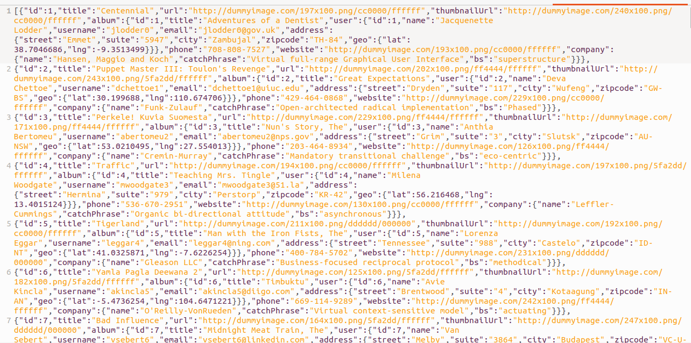

# ApyTypeScript
## Descripcion
Este sitio nos provee de varias metodos que nos permite poder consultar datos de una fuente informacion(base de datos) para el fin en un archivo tipo json que contiene los datos de las imagenes.
### Metodos 
#### Consulta individual
Este nos permitira poder obtener los datos de informacion de una imagen en particular accediendo por su id(llave o identificar de imagen), para ello utilizaremos el siguiente url:

http://**{sitename}**/externalapi/photos/**{id}**

**{sitename}** : hostname o url donde este alojado la aplicacion.

**{id}** : identificador de las imagenes

**Consultas**

Podemos hacer consultas individuales de usuarios, albums, photos, las urls son las siguientes:

* http://**{sitename}**/externalapi/users/**{id}**

* http://**{sitename}**/externalapi/albums/**{id}**
* http://**{sitename}**/externalapi/photos/**{id}**

### Consulta con filtro
Esta consulta nos permitira realizar una busqueda en la base de datos y filtrar la informacion, por medio de una busqueda de los elementos, para ello debemos de indicar la ruta del elemento a buscar, la url principal:

http://**{sitename}**/externalapi/photos **{parmetros}**

**{sitename}** : hostname o url donde este alojado la aplicacion.

**{parmetros}** : los parametros de busqueda pueden ser los siguientes:
* **limit**: Este parametro permite limitar la cantidad de datos que se devuelve utilizado para el pagineo de los datos, el valor default es **25**.
* **offset**: Este parametro nos permite indicar la posicion inicial desde donde se empieza a contar para devolver la informacion el valor default si no se envia el parametro es **0**.

* **rutas**: Los datos podremos filtrarlos por medio de busquedas en las rutas donde se encuentra la informacion, por ejemplo podriamos hacer una busqueda por titulo de la imagen el parametro seria **title=atardecer**, podriamos hacer una busqueda por la ciudad de residencia del usuario **album.user.address.city=Guatemala**, podriamos hacer una busqueda por el nombre del album de fotos **album.title=Fotos2024**

## Ejecucion

Podemos ejecutar el sitio por medio del los comandos:
* npm run dev este seria el metodo dev, y por default el sitio esta escuchando en el puerto 7000, este valor puede moficarse por medio del archivo .env:

* npm start start:prod este permite ya poder ejecutarlo, desde los objetos generados y compilados

## Librerias y modulos
Desarrollado con:
* typescript
* nodejs

## Base de datos
La informacion utilizada se esta cargando por medio del archivo Albums.json que contiene un json con la estructura, similar a la que se indicaba, este se encuentra en la raiz de la aplicacion.

## Repositorio
La url que contiene los fuentes esta en el siguiente link :
https://github.com/capcomasd1080/apitypescriptrepositoryweb102